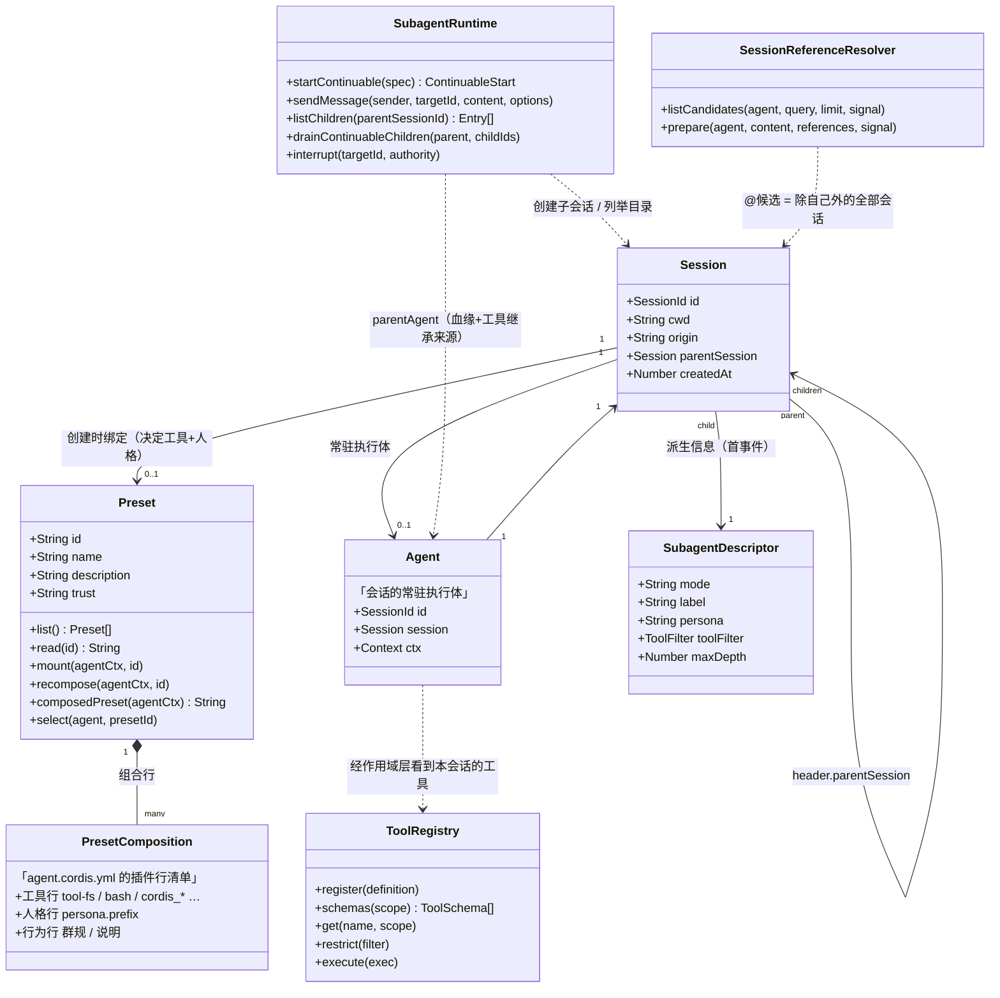
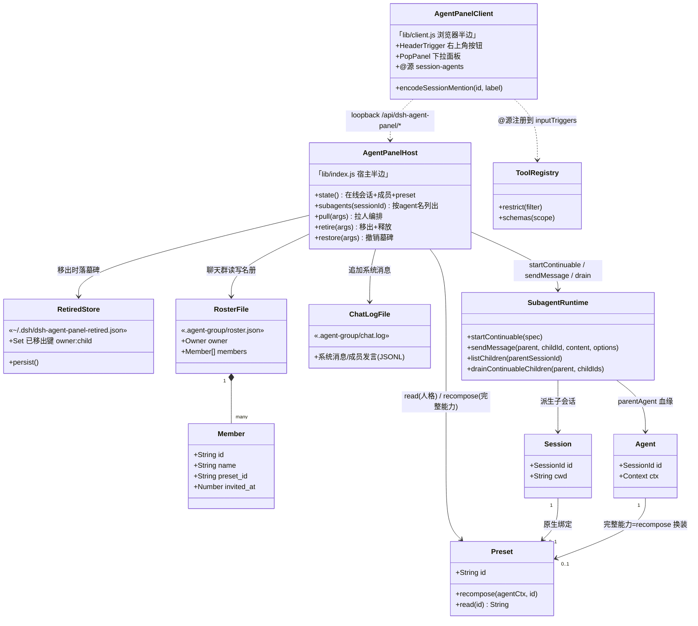
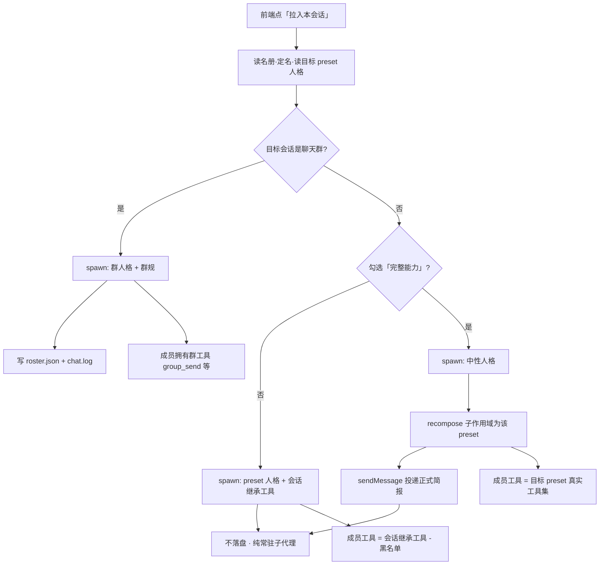
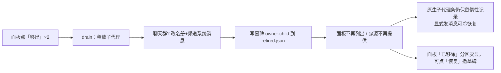

# Agent / 子代理 / Preset / 会话 —— 关系类图

> 依据 DSH 0.1.5-rc.1 运行时源码阅读与行为实验整理；为可读性做了简化，
> 只列出与本插件相关、且**实际验证过**的属性与方法。

## 0. 先分清四个词（大白话）

| 词 | 是什么 | 一句话 |
|---|---|---|
| **Session 会话** | 一段对话的持久化容器 | 有 id、工作目录、日志；子代理本身也是会话 |
| **Agent** | 会话里「活着的执行体」 | 一个会话同一时刻最多一个常驻 Agent；空闲可能被卸载（冷恢复） |
| **Preset** | 岗位模板 | 一份插件行清单 = **工具 + 人格 + 行为约束**，会话创建时绑定一个 |
| **子代理 Subagent** | 由某会话派生的子会话 | `origin='subagent'`，继承父会话的工具，可附带人格与黑名单 |

---

## 1. 未安装插件：原生关系

### 原生语义的两个关键点（常见误解的来源）

1. **子代理不是新 preset 的载体。** `startContinuable` 只传 `persona`（人格文本）
   与 `toolFilter`（黑名单），**工具永远继承父会话**——「换脑子不换手」。
2. **`@` 引用菜单没有「子代理」概念。** 它列出除自己外的**所有**会话，
   按 cwd 亲缘排序；别人的子代理继承其父 cwd，反而排在前面。

---

## 2. 安装本插件后：聊天群 + 完整能力开关

新增角色：**面板宿主**（编排拉人/移出/恢复）、**面板客户端**（触发器 + 下拉卡片 + `@` 新源）、
**墓碑库**（跨重启记住已移出）、**名册/频道文件**（聊天群状态的落盘）。

### 拉人编排（`pull`）的分支逻辑

> **聊天群成员强制忽略「完整能力」**：recompose 会剥掉 `group_send` / `group_read`
> 这些群工具，群规就破了——所以群成员固定走「继承群工具」路线，选项被忽略并提示。

---

## 3. 三种成员形态对照

| 形态 | 脑子（人格） | 手（工具） | 落盘 | 典型用途 |
|---|---|---|---|---|
| 群成员（聊天群拉人，开关忽略） | 目标 preset | **群工具**（group_send 等）+ 会话继承 − 黑名单 | roster.json + chat.log | 群内协作、@派活 |
| 普通成员（普通会话，开关关闭） | 目标 preset | **会话继承** − 黑名单 | 无 | 同房间出主意/调研 |
| 完整能力成员（普通会话，开关开启） | 目标 preset（recompose 挂入） | **目标 preset 真实工具集** | 无 | 跨能力借用（如极简模式里用创造模式） |

---

## 4. 移出与恢复的生命周期

---

## 5. 兼容性风险备注

- `@` 过滤包装了 shipped 的 `sessionReferenceResolver.listCandidates`
  （运行时可逆，不改文件）；上游若重命名该方法，过滤静默失效，面板其余功能不受影响
- 完整能力依赖 `agentPresets.recompose` 对「已创建子作用域」的支持（实验验证可用）；
  上游行为变化需回归 `test/` 下两个测试与一次手动拉取验证
