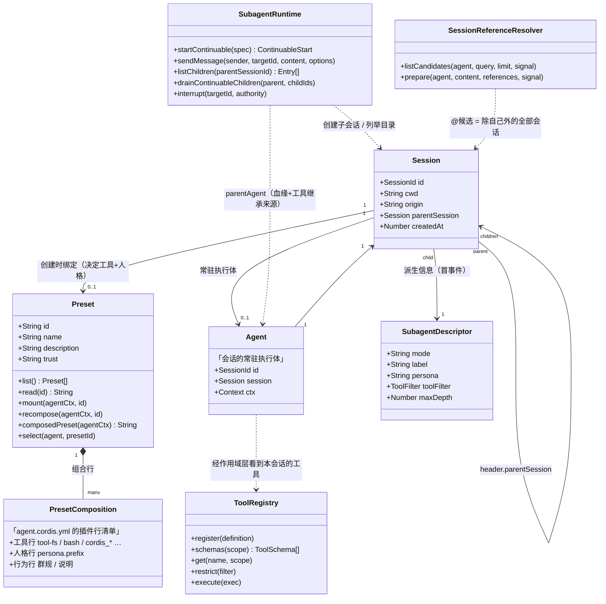
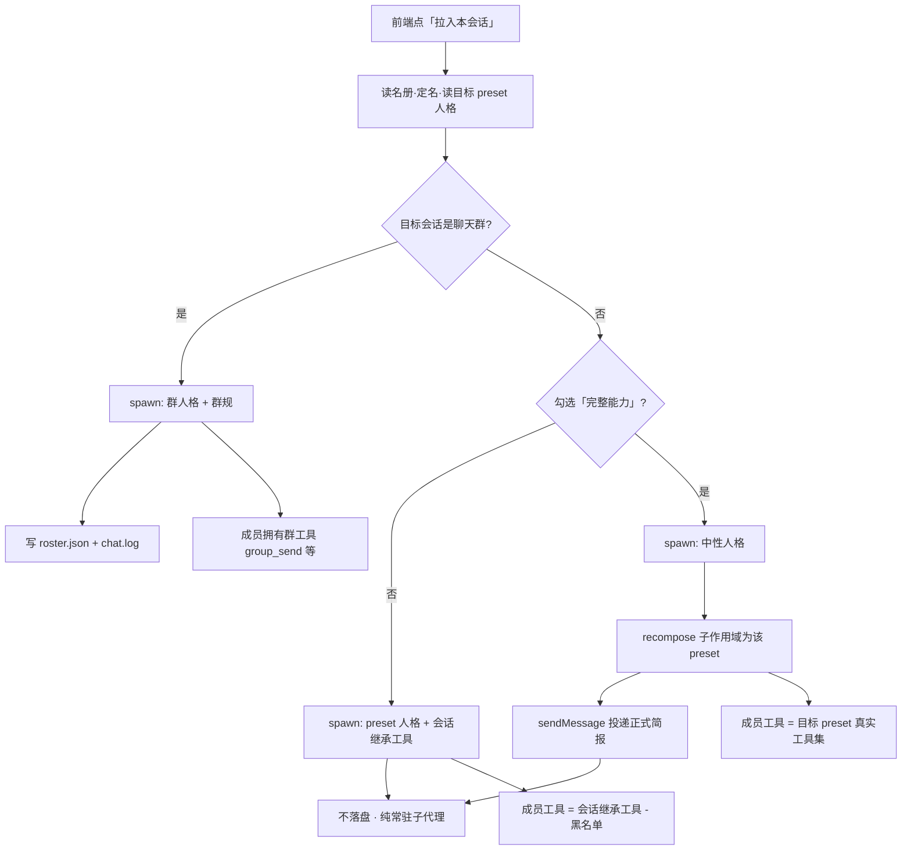
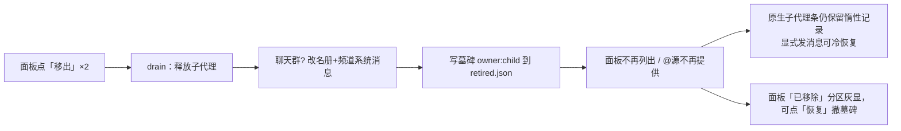

# Agent / 子代理 / Preset / 会话 —— 关系类图

> 依据 DSH 0.1.5-rc.1 运行时源码阅读与行为实验整理；为可读性做了简化，
> 只列出与本插件相关、且**实际验证过**的属性与方法。

## 0. 先分清四个词（大白话）

| 词 | 是什么 | 一句话 |
|---|---|---|
| **Session 会话** | 一段对话的持久化容器 | 有 id、工作目录、日志；子代理本身也是会话 |
| **Agent** | 会话里「活着的执行体」 | 一个会话同一时刻最多一个常驻 Agent；空闲可能被卸载（冷恢复） |
| **Preset** | 岗位模板 | 一份插件行清单 = **工具 + 人格 + 行为约束**，会话创建时绑定一个 |
| **子代理 Subagent** | 由某会话派生的子会话 | `origin='subagent'`，继承父会话的工具，可附带人格与黑名单 |

---

## 1. 未安装插件：原生关系



### 原生语义的两个关键点（常见误解的来源）

1. **子代理不是新 preset 的载体。** `startContinuable` 只传 `persona`（人格文本）
   与 `toolFilter`（黑名单），**工具永远继承父会话**——「换脑子不换手」。
2. **`@` 引用菜单没有「子代理」概念。** 它列出除自己外的**所有**会话，
   按 cwd 亲缘排序；别人的子代理继承其父 cwd，反而排在前面。

---

## 2. 安装本插件后：聊天群 + 完整能力开关

新增角色：**面板宿主**（编排拉人/移出/恢复）、**面板客户端**（触发器 + 下拉卡片 + `@` 新源）、
**墓碑库**（跨重启记住已移出）、**名册/频道文件**（聊天群状态的落盘）。


### 拉人编排（`pull`）的分支逻辑



> **聊天群成员强制忽略「完整能力」**：recompose 会剥掉 `group_send` / `group_read`
> 这些群工具，群规就破了——所以群成员固定走「继承群工具」路线，选项被忽略并提示。

---

## 3. 三种成员形态对照

| 形态 | 脑子（人格） | 手（工具） | 落盘 | 典型用途 |
|---|---|---|---|---|
| 群成员（聊天群拉人，开关忽略） | 目标 preset | **群工具**（group_send 等）+ 会话继承 − 黑名单 | roster.json + chat.log | 群内协作、@派活 |
| 普通成员（普通会话，开关关闭） | 目标 preset | **会话继承** − 黑名单 | 无 | 同房间出主意/调研 |
| 完整能力成员（普通会话，开关开启） | 目标 preset（recompose 挂入） | **目标 preset 真实工具集** | 无 | 跨能力借用（如极简模式里用创造模式） |

---

## 4. 移出与恢复的生命周期



---

## 5. 兼容性风险备注

- `@` 过滤包装了 shipped 的 `sessionReferenceResolver.listCandidates`
  （运行时可逆，不改文件）；上游若重命名该方法，过滤静默失效，面板其余功能不受影响
- 完整能力依赖 `agentPresets.recompose` 对「已创建子作用域」的支持（实验验证可用）；
  上游行为变化需回归 `test/` 下两个测试与一次手动拉取验证

---

## 6. 类与参数详解

### 6.1 Session 会话

**作用**：一段对话的持久化容器。子代理本身也是一个会话（`origin='subagent'`），
「会话树」由 `header.parentSession` 串起来。

| 属性 | 类型 | 说明 |
|---|---|---|
| `id` | SessionId | `session-<uuid>`，跨重启稳定（墓碑键的一半） |
| `cwd` | string | 工作目录；子代理**继承**父会话的 cwd（`@` 排序亲缘的来源） |
| `origin` | `'subagent'` \| `undefined` | `undefined` = 根会话；`'subagent'` = 派生会话 |
| `parentSession` | SessionId \| undefined | 子代理的父会话 id（面板「已移除」按它归属） |
| `createdAt` | number | 创建时间 |
| `isSeeded` | boolean | 是否由种子事件创建（影响标题投影能否回答） |

**方法**（与插件相关的）：

| 方法 | 说明 |
|---|---|
| `append(event)` | 向会话日志追加事件（子代理的 `subagent/descriptor` 就是这么进去的） |
| —— 其余（日志读写、压缩、投影） | 由 DSH 内部服务管理，插件不直接触碰 |

**生命周期**：创建（绑定 preset）→ 常驻（Agent 挂载）→ 空闲卸载（冷态，收到消息可冷恢复）。

### 6.2 Agent 执行体

**作用**：会话里「活着的执行体」，驱动模型步进与工具调用。
`Agent` 对外暴露的面非常小（`{ id }`），其余通过 `session` 与 `ctx` 访问。

| 属性 | 类型 | 说明 |
|---|---|---|
| `id` | SessionId | 与所属会话 id 相同 |
| `session` | Session | 所属会话（`header.cwd` / `header.parentSession` 从这读） |
| `ctx` | Context | 该作用域的 Cordis 上下文——工具、服务都从这里解析；**完整能力模式就是往这个 ctx 上 recompose** |

**获取方式**：`agents.get(sessionId)`（仅**常驻**时返回；空闲卸载后为 undefined，
需先发消息冷恢复）。面板据此判定「目标会话是否在线、可拉人」。

**生命周期**：`agents.create`（新会话，父作用域决定基础组合）→ 运行 → dispose。
注意：子 Agent 的基础组合来自**父作用域**——这是「拉人不换工具」的机制根源。

### 6.3 Preset 与 `agentPresets` 服务

**Preset 属性**（`list()` 观测）：

| 属性 | 类型 | 说明 |
|---|---|---|
| `id` | string | 如 `cordis`、`se`、`standard`（组合目录名） |
| `name` | string | 显示名（拉人面板展示用） |
| `description` | string | 描述（面板卡片副文案） |
| `trust` | `'system'` \| `'user'` | 内置 or 用户安装 |
| `path` | string | 组合文件（`agent.cordis.yml`）绝对路径 |

**`agentPresets` 服务方法**：

| 方法 | 参数 → 返回 | 说明 |
|---|---|---|
| `list()` | — → `Preset[]` | 全部已安装 preset（面板「可拉取的 Agent」来源，排除聊天群自身） |
| `read(id)` | id → `string` | 组合文件原始文本；本插件从中解析 `persona.prefix` 作为成员人格 |
| `resolve(id)` | id → `Preset` | 定位组合文件 |
| `composedPreset(agentCtx)` | ctx → `string \| undefined` | 该作用域当前绑定的 preset id（子作用域无绑定时**回落到部署根绑定**，实测为本部署的 `cordis`） |
| `mount(agentCtx, id)` | ctx, id → 挂载组合 | **对已创建的子作用域会被 `dsh-scope` 拒绝**（“已绑定父作用域，禁止 re-link”）——实验结论 |
| `recompose(agentCtx, id)` | ctx, id → 换装 | **完整能力模式的核心**：把已存在会话换装为另一 preset（实测 `composedPreset` 翻转且工具面真实改变） |
| `select(agent, id)` | agent, id → 换绑（recompose 的远程/Agent 面） | recompose 失败时的备选（实验中未走到） |
| `standingKeyFor(id)` | id → ScopeKey | 该 preset 的常驻作用域键 |
| `compositionInventory()` | — → 组合清单 | 各 preset 的行清单（「能力匹配提示」的潜在数据源，未接入） |
| `copy` / `remove` | 管理安装/卸载 | |

**组合文件**：`agent.cordis.yml` 的插件行决定一切——工具行（如 `tool-fs`、`custom-bash`、`tool-cordis`）→ 工具；`persona` 行 → 人格段；行为行 → 提示词段。**recompose 换装后，这些都会进入子代理作用域。**

### 6.4 SubagentRuntime（`subagents` 服务）

子代理的创建、投递、释放、目录列举都在这里。**没有「删除子代理」原语**——
记录永久保留以支持冷恢复，这是本插件「移出 = 释放 + 墓碑」设计的根源。

| 方法 | 参数 → 返回 | 说明 |
|---|---|---|
| `startContinuable(spec)` | spec → `{childId, messageId}` | 见下方 spec 明细 |
| `sendMessage(sender, targetId, content, {signal})` | → MessageId | `sender` 必须是 `targetId` 的**直接父**（或直接子）；不在线的直接子会**冷恢复**后接收 |
| `listChildren(parentSessionId, signal?)` | → `SubagentListEntry[]` | 父会话的直接子代理目录（面板「已有成员/已移除」的数据源之一） |
| `drainContinuableChildren(parent, childIds)` | parent(Agent), ids → void | **释放驻留激活**（「移出」的执行动作）；持久记录仍在 |
| `drainContinuableDescendants(parents)` | parents(Agent[]) → void | 关闭整棵子树 |
| `interrupt(targetId, authority)` | authority = `{kind:'user', parentSessionId}` 或 `{kind:'ancestor', agent}` | 中断当前轮，不清记录 |
| `prompt(request, signal)` | 浏览器远程投递（含时区/附件） | 面板未用 |
| `listDescendants(rootId, signal?)` | 全树遍历 | 面板未用 |

**`startContinuable.spec` 明细**：

| 字段 | 说明 |
|---|---|
| `provider` | `'spawn'`（本机进程内）或 `'fork'` |
| `label` | **agent 名**（面板成员名、子代理条展示名都来自它） |
| `childId?` | 指定子会话 id（一般不传） |
| `signal` | 取消信号（动态沙箱无 `AbortController`，插件用鸭子类型对象） |
| `request.prompt` | 首条消息 `[{type:'text', text}]` |
| `request.parent` | **父 Agent**（决定子代理的作用域/工具/血缘） |
| `request.persona` | 人格文本（叠加在继承组合之上） |
| `request.toolFilter` | `{allow?:[]}` / `{deny?:[]}`；deny 名字须在父作用域已知 |
| `request.maxDepth` | `1` = 子代理不能再拉人 |

**`SubagentListEntry`**（`listChildren` 的条目）：

| 字段 | 说明 |
|---|---|
| `kind` | `'child'` / `'diagnostic'`（损坏或无法识别的记录） |
| `id` | 子会话 id |
| `activity` | `'running'` / `'inactive'`（面板成员状态来源） |
| `mode` | `'continuable'` / `'one-shot'` |
| `label` | agent 名（面板用它当成员名） |
| `hasChildren` | 是否还有下层 |

#### 6.4.1 SubagentDescriptor（子代理描述符）

**作用**：子代理的「出生证明」。创建时由 `snapshotSubagentDescriptor(...)` 生成，
以 `subagent/descriptor` 事件**追加进子会话日志**，随后被子代理目录与投影缓存读取——
它是子代理的 **agent 名（label）、模式、人格、黑名单**的唯一持久来源。
**一旦写入不可修改**（没有更新接口；会话日志是 append-only）——
这正是「原生子代理条不能改名/删除」的机制根源，也是本插件用墓碑做「已移除」标记的原因。

**两种形态**（`SubagentDescriptorData`）：

*continuable（常驻——面板拉的都是这种）*

| 字段 | 类型 | 说明 |
|---|---|---|
| `mode` | `'continuable'` | 常驻模式 |
| `label` | string | **agent 名**（面板成员名、原生子代理条显示名的来源） |
| `provider` | string | 提供方：`'spawn'` / `'fork'`（实测 spawn 时写入） |
| `agentProvider?` | string | 子代理的模型提供方（继承或显式指定时记录） |
| `agentModel?` | string | 模型 |
| `agentReasoningEffort?` | string | 推理力度 |
| `persona?` | string | 拉人时注入的人格文本 |
| `toolFilter?` | `{allow?, deny?}` | 工具黑白名单 |

*one-shot（一次性委派）*

| 字段 | 说明 |
|---|---|
| `mode` | `'one-shot'` |
| `label?` | 可选名字（没起名时目录条目回退用 id） |

**相关类型**：

| 类型 | 说明 |
|---|---|
| `SubagentCapabilities` | 提供方能力声明，5 个布尔位：`agentOptions` / `outputSchema` / `depthLimit` / `toolFilter` / `persona`。spawn 提供方全支持——所以面板能传 persona / toolFilter / maxDepth |
| `SubagentStartRequest` → `ResolvedSubagentStartRequest` | 后者 = 前者 + `descriptor`，是提供方 `start(request)` 的实际入参 |
| `SubagentResult` | `{output, structured?, diagnostic?, stopReason}`；`stopReason` ∈ completed / aborted / error / max-tokens / refusal |

**与其它类的关系**：

- **写入**：SubagentRuntime 在 `materializeTracked` 的 setup 里
  `child.session.append("subagent/descriptor", descriptor)`（子会话日志首事件之一）
- **读取**：`listChildren` / 原生子代理目录 / 投影缓存——label 与模式的分类
  「唯一依据是 subagent 投影」，目录条目的 `label` 就是这里的 `label`
- **不可变 ⇒**：本插件无法实现「给已移除成员改名」，只能用墓碑隐藏 + 「已移除」标记

### 6.5 ToolRegistry（`tools` 服务）与工具过滤

| 方法 | 参数 → 说明 |
|---|---|
| `register(definition)` | 注册工具。definition：`{name, description, parameters(JSON Schema), output:{schema, render}, execute(args, exec)}`；`agrp_pull` 就是这么注册的 |
| `schemas(scope?)` | 某**作用域**可见工具的 schema 列表（面板/探针的读法；不带 scope 时是调用方视角） |
| `get(name, scope?)` | 取定义 |
| `restrict(filter)` | 在**当前作用域**收走工具（`{allow:[...]}` 或 `{deny:[...]}`）。子代理创建时由组合装配调用——这就是「工具继承 − 黑名单」的落点 |
| `guard(guard)` | 执行前守卫 |
| `execute(input)` | 执行一次工具调用 |

**坑**：`restrict` 校验 deny 名字时按**当时作用域**的已知工具集进行，未知名字直接报错并列出合法集合——
插件解析该报错信息做**精确降级**，而不是盲目猜。

### 6.6 SessionReferenceResolver（`@` 引用）

| 成员 | 参数 → 说明 |
|---|---|
| `listCandidates(agent, query, limit?, signal?)` | 候选 = **除自己外的全部会话**（无子代理概念），按 cwd 亲缘排序，截断 `candidateLimit`（默认 50）。返回 `{sessionId, label, cwd?, sameWorkspace, createdAt, mention}`。本插件在此处包了一层过滤 |
| `remoteExportCandidates(agent, query, signal)` | 浏览器 `@` 菜单实际调用的远程面（内部转调 `listCandidates`，追加 `mention`） |
| `prepare(agent, content, references, signal)` | 把消息中的 canonical mention 换成人读文本，并把对应会话快照注入上下文（选中候选后真正生效的地方） |
| `config` | `maxReferences`（≤3）、`candidateLimit`（50）、`maxReferenceBytes`、`referenceContextFraction` |

**mention 编码**（客户端必须逐字节兼容）：
`@[label](dsh-session:<base64url(JSON.stringify(sessionId))>)`，label 转义 `\` 与 `]`。
`test/mention-codec.test.mjs` 负责守护这一点。

### 6.7 AgentPanelHost（插件宿主半边）

**作用**：面板的编排层——状态聚合、拉人、移出、恢复，外加一个供 agent 侧直接拉人的模型工具。

**路由**：

| 路由 | 入参 | 出参要点 |
|---|---|---|
| GET `/state` | — | `{groups:[{session_id, cwd, owner_id, owner_name, owner_live, has_roster, members, removed, messages}], presets, caps}` |
| GET `/subagents?sessionId=` | 单会话 | `{members:[{id, name, status, mode}]}`（已排除墓碑；`name`=agent 名） |
| POST `/pull` | 见下 | `{ok, member_id, name, preset_id, group?, warning?}` |
| POST `/retire` | 见下 | `{ok, name, warning?}` |
| POST `/restore` | 见下 | `{ok, name, warning?}` |

**`pull` 参数**：

| 参数 | 必填 | 说明 |
|---|---|---|
| `sessionId` | ✓（或 `ownerId`） | 目标会话 |
| `cwd` | 可选 | 缺省由 sessionId 推导 |
| `ownerId` | 可选 | 名册归属匹配后会被校验，防止串群 |
| `presetId` | ✓ | 要拉的 preset |
| `name` | 可选 | 成员显示名（缺省自动去重） |
| `fullCapability` | 可选 | 完整能力模式；聊天群成员自动忽略并提示 |

**`pull` 内部步骤**：读名册（校验归属）→ 定 parent（必须常驻）→ 读 preset 人格 →
成员名去重 → `startContinuable`（黑名单降级重试）→（完整能力且非群）`recompose` + 投递简报 →
（聊天群）写 `roster.json` + `chat.log` → 失败分支全部有明确提示且不产生脏状态。

**`retire` 参数**：`{sessionId, cwd?, memberId}`。聊天群：改名册 + 频道系统消息；
一律 `drainContinuableChildren` 释放代理 + 记墓碑。名册写失败则完全不改动。

**`restore` 参数**：`{sessionId, memberId}`。仅删除墓碑（撤销隐藏）；代理保持已释放状态。

### 6.8 AgentPanelClient（浏览器半边）

**槽位注册**：
`conversation.session.header.utilities`（触发器按钮）+ `shell.overlay`（下拉面板）。

**`@` 源对象字段**：

| 字段 | 说明 / 坑 |
|---|---|
| `trigger: '@'` | 与 shipped 的 reference 源**同名 trigger 不同 name**，两个源候选拼接 |
| `name: 'session-agents'` | (trigger, name) 重复会抛错 |
| `order: -10` | 排在 Sessions/Files 之前 |
| `showGroupTitle: false` | 与 shipped 一致；分组标题由条目 `section` 渲染 |
| `candidates(session, req)` | `session.sessionId` 可取当前会话；**永不 reject**（控制器会丢弃失败的源），内部全 try/catch |
| （不提供 `header`） | 该钩子是「钻取面包屑」，须返回**面包屑数组**；返回字符串会炸掉整个菜单渲染——实测踩过 |
| `onPick({candidate})` | 返回 `{insert:{source:'reference', ref:mention, label, appearance:'session', clipboardText}}`，复用原生引用插入管线 |

**`api`**（均 loopback 同源）：`state` / `pull` / `retire` / `restore` / `subagents(sessionId)`。

**`encodeSessionMention(sessionId, label)`**：`dsh-session:` + base64url(`JSON.stringify(id)`)，
label 转义；由 `test/mention-codec.test.mjs` 与 shipped codec 逐字节比对守护。

### 6.9 RetiredStore 墓碑库

- 文件：`~/.dsh/dsh-agent-panel-retired.json`，内容为字符串数组 `["ownerId:childId", …]`
- 会话 id 跨重启稳定 → 墓碑键长期有效
- 局限：仅本插件运行期生效的「隐藏」语义；DSH 原生子代理条不受影响（产品层设计）

### 6.10 落盘文件结构

**`roster.json`**（聊天群名册）：

```json
{ "owner": { "id": "session-…", "name": "主持人" },
  "members": [ { "id": "…", "name": "SE 需求分析", "preset_id": "se", "invited_at": 1789500469505 } ] }
```

**`chat.log`**（JSONL，一条一行）：

```json
{"kind":"system","seq":1,"ts":…,"text":"…加入群聊"}
{"kind":"message","seq":2,"ts":…,"speaker":"SE 需求分析","speaker_id":"…","mentions":[],"mention_ids":[],"text":"…"}
```

**`retired.json`**：`["<ownerSessionId>:<childSessionId>", …]`

### 6.11 关键时序

**拉人（完整能力 ON，普通会话）**：
前端点按钮 → `POST /pull` → 读 preset 人格 → spawn（中性人格/提示）→ recompose(子作用域→preset)
→ `sendMessage` 投递正式简报 → 面板刷新（成员 + 状态）。

**移出**：两次点击 → `POST /retire` →（聊天群）改名册 + 频道消息 → drain 释放 → 落墓碑 → 刷新。

**`@` 引用**：选中「本会话子 agent」条目 → 插入 `@[agent名](dsh-session:…)` → 消息提交后
`sessionReferenceResolver.prepare` 把该 agent 会话的快照注入 prompt 上下文。
